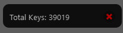

# EFramesCount: Maya Keyframe Counter

The `EFramesCount` script provides an easy-to-use interface for counting keyframes on selected controls in Autodesk Maya. It is designed to streamline the animation process by giving animators quick insights into the number of keyframes they are working with.



## Installation

1. Place the `EFramesCount.py` file in the `scripts` folder of your Maya directory.
2. Place the `EFramesCount` folder in the `prefs/icons` folder of your Maya directory.

## Usage

To use the script, execute the following commands in Maya's script editor or Python command line:

```python
import EFramesCount
EFramesCount.create_eFramesCount_window()
```

This will open a window displaying the count of keyframes on the currently selected controls.
